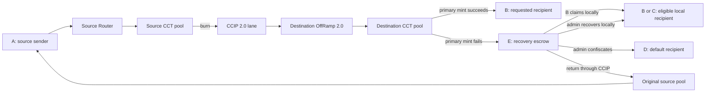
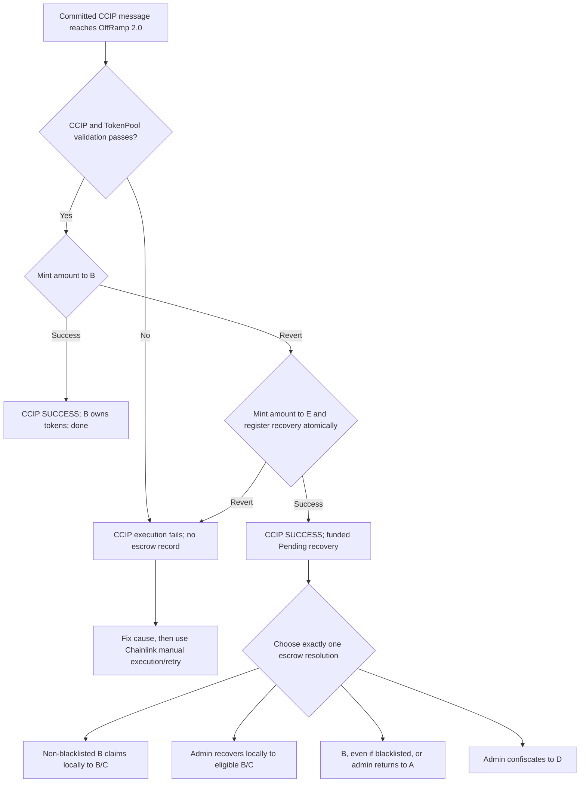
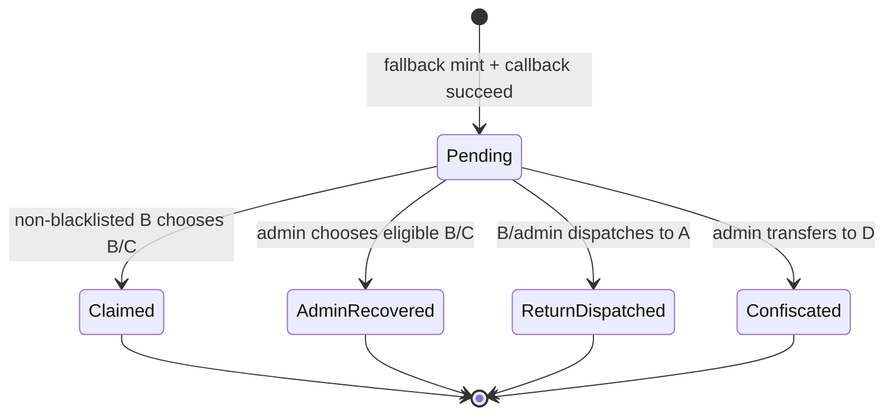

# CCIP 2.0 CCT pool and recovery escrow

Status: implemented and development-verified V2-only design; not a deployment runbook

Last reviewed: 2026-08-10

Scope: EVM, CCIP 2.0 lanes and ramps, direct CCT token transfers, hub-and-spoke routes

## 1. Purpose

This document defines the implemented behavior of the Midas custom CCT burn/mint pool and recovery escrow. It is the reference for code, tests, prepared operational helpers, and later deployment documentation.

The design deliberately has no bridge adapter. A user sends the token through the Chainlink Router; the Router moves it into the source pool, the source pool burns it, and the destination pool either mints to the requested recipient or atomically mints into the recovery escrow.

The recovery escrow exists for one specific application-level failure: the destination token cannot be minted to the requested recipient, most commonly because that recipient is blacklisted or is not greenlisted. CCIP itself remains responsible for failures that make the destination execution revert, such as CCIP validation, rate limiting, insufficient token-pool gas, a broken pool, or a broken fallback.

This document does not treat old test deployments, CCIP 1.x compatibility, Axelar, LayerZero, or an adapter migration as requirements.

The existing LayerZero code is precedent only for token policy, not for this recovery state machine. Its direct mint/burn adapter calls mToken mint and lets a failed destination mint follow LayerZero failure/retry behavior; it has no recovery escrow. A separate vault-composer flow catches a failed composed vault action and sends a new OFT refund, but that is an EOA-oriented programmable vault flow rather than native token bridging. The CCIP one-hop return is therefore an explicit business requirement implemented on the funded escrow record, not a copied LayerZero adapter behavior.

## 2. Evidence and confidence labels

The design uses four kinds of evidence:

- **Chainlink public documentation**: protocol behavior documented by Chainlink.
- **Pinned CCIP 2.0 source**: behavior verified against the repository's installed `@chainlink/contracts-ccip@2.0.0` implementation.
- **Midas source**: current token, pool, escrow, and tests in this repository.
- **Chainlink engineering confirmation**: the private project discussion supplied by the team. Chainlink engineering confirmed that the custom pool-to-escrow fallback works on a 2.0 lane. This is useful confirmation, but the implementation and tests must still prove the behavior against the exact pinned contracts.

The important source links are collected in [Section 19](#19-evidence-index). Where this document says **required**, that is a Midas design requirement even if Chainlink does not prescribe it.

### 2.1 Confirmed project decisions

The following items come from the supplied project discussion and this review; they are not inferred from Chainlink:

| Decision             | Confirmed requirement                                                                                                                                                       |
| -------------------- | --------------------------------------------------------------------------------------------------------------------------------------------------------------------------- |
| Protocol scope       | CCIP 2.0 OnRamp/OffRamp lanes only. No V1.x adapter or compatibility architecture.                                                                                          |
| Architecture         | Keep one non-upgradeable custom CCT pool plus one upgradeable recovery escrow per token/chain.                                                                              |
| Routes               | Hub-and-spoke only, bidirectional on each configured hub edge; no direct spoke-to-spoke route.                                                                              |
| Deployments          | No current deployment constrains ABI/storage choices. Code, tests, docs, and prepared future-deployment helpers are the present scope.                                      |
| Recovery actors      | A may differ from B. B controls self-service local claim and fixed return; there is no separately nominated recovery actor.                                                 |
| Source compliance    | A blacklisted direct Router caller cannot initiate a surviving bridge. Permissioned token rules remain authoritative.                                                       |
| Destination fallback | Direct mint to B; if that mint fails, atomically mint to E and register. If E mint/registration fails, revert into CCIP retry/manual execution.                             |
| Local resolution     | Non-blacklisted B may claim to eligible B/C. Shared escrow admin may recover to eligible B/C even when B is blacklisted.                                                    |
| Return               | B, including blacklisted B, or shared escrow admin may dispatch one fixed return to authenticated source A. A return-generated recovery is local-only.                      |
| Confiscation         | Shared escrow admin may transfer a Pending recovery to current D as an explicit terminal action.                                                                            |
| Orphans              | `registerOrphanedBulk` is removed; a failed fallback cannot produce state that requires synthetic registration.                                                             |
| Admin role           | One shared `FALLBACK_ESCROW_ADMIN_ROLE` is accepted for the current implementation.                                                                                         |
| Batches              | Atomic, nonempty, and subject only to transaction gas; there is no arbitrary record-count cap.                                                                              |
| Fees                 | Preserve Kostya's current absence of a Midas-specific fee policy. Calculate native CCIP return payment correctly and refund excess.                                         |
| Recovery lifetime    | Pending recoveries do not expire automatically. Time alone never changes their status or removes a resolution path.                                                         |
| Amount boundary      | Midas adds no positive minimum. CCIP rejects a zero-token send; every positive base-unit amount is allowed subject to ordinary CCIP validation and configured rate limits.  |
| Finality/features    | Use the minimal wait-for-finality, token-only flow. Fast finality, custom hooks, gasless relaying, and token-plus-data UX are not in scope.                                 |
| Development method   | Design/test documentation first; then implement the complete desired-behavior suite, observe real RED/GREEN results, and only then change production code.                  |
| Coverage             | 100% statements, branches, functions, and lines for the two custom contracts; vendored code is proven through exact V2 integration rather than included in the denominator. |

### 2.2 Reconciliation with the stashed documentation

The CCIP documentation packet in `stash@{1}` was reviewed read-only; no stashed code or document was applied. It describes the abandoned adapter architecture and is historical evidence, not the source of truth for this design.

| Historical item                                                                                      | Treatment in this design                                                                                                                                                |
| ---------------------------------------------------------------------------------------------------- | ----------------------------------------------------------------------------------------------------------------------------------------------------------------------- |
| Fund every recovery before recording it; track `totalReserved`; preserve atomic terminal transitions | Retained. These invariants apply directly to pool-funded escrow liabilities.                                                                                            |
| Quote the exact return message, forward only the current native fee, and refund surplus              | Retained. This fixes the same Router overpayment behavior without adding a Midas fee policy.                                                                            |
| Separate funded Midas recovery from failed/retryable CCIP execution                                  | Retained. This is the central operational decision rule in Section 8.                                                                                                   |
| Use events, direct lookup, and invariant tests for reconciliation                                    | Retained, but adapted to a local `recoveryId` because a CCT pool does not receive the inbound CCIP message ID.                                                          |
| Upgradeable recovery state with a small non-upgradeable pool                                         | Retained, matching the confirmed pool + escrow architecture.                                                                                                            |
| `MidasCCIPAdapter`, token-plus-data delivery, adapter-only initiation, and V1.6 compatibility        | Rejected. Direct Router/CCT V2 token transfer is the confirmed architecture.                                                                                            |
| Real inbound CCIP message ID as the recovery mapping key                                             | Not available at the pool callback boundary. The escrow uses the exact local ID formula in Section 9 and monitoring correlates the destination transaction offchain.    |
| Receiver-callback gas and a 500,000 callback budget                                                  | Not applicable to this token-only zero-callback-gas flow. The relevant constraint is OffRamp token-handling gas, measured as specified in Section 17.                   |
| Fixed 20-record admin caps and mutable-set pagination                                                | Rejected by the confirmed no-arbitrary-cap decision. Batches remain atomic and gas-bounded; pending IDs are indexed from events and verified by direct lookup/counters. |
| Exceptional/orphan registration                                                                      | Rejected. It would recreate synthetic liabilities that the corrected atomic fallback makes impossible.                                                                  |
| No automatic Pending-record expiry                                                                   | Retained and explicitly confirmed. A record remains Pending until one defined terminal resolution succeeds.                                                             |
| No Midas positive minimum amount                                                                     | Retained and explicitly confirmed. CCIP's zero-token rejection remains; Midas adds no higher threshold.                                                                 |

## 3. Terms

| Symbol          | Meaning                                                                                                       |
| --------------- | ------------------------------------------------------------------------------------------------------------- |
| `A`             | Original sender on the source chain. CCIP 2.0 carries this value to the destination pool as `originalSender`. |
| `B`             | Requested token recipient on the destination chain.                                                           |
| `C`             | Explicit replacement local recipient chosen by `B` or an escrow admin.                                        |
| `E`             | Recovery escrow on the current chain; also the pool's configured fallback receiver.                           |
| `D`             | Default recipient that receives administratively confiscated recoveries.                                      |
| `ccipMessageId` | Chainlink's identifier for a cross-chain message.                                                             |
| `recoveryId`    | Midas-local identifier for one funded escrow liability. It is not a CCIP message ID.                          |

The CCIP 2.0 pool input contains `originalSender`, source-chain selector, destination receiver, and amount, but does **not** contain the CCIP message ID. Therefore the automatic callback must create a unique local `recoveryId`; monitoring correlates it with the destination execution transaction and CCIP message offchain.

## 4. Architecture



Only configured hub edges exist. For example, Base to Ethereum and Avalanche to Ethereum may exist, while Base to Avalanche does not. Recovery functions must not create an arbitrary spoke-to-spoke route.

## 5. Non-negotiable invariants

1. **No adapter.** Normal sends use the Chainlink Router and the registered custom CCT pool directly.
2. **Source policy is enforced before a burn can survive.** The Router transfers tokens from `A` to the source pool. The permissioned token checks `A` and the pool during that transfer. If the transfer, OnRamp, pool validation, or burn later reverts, the entire source transaction rolls back.
3. **A successful fallback is atomic.** Minting to `E` and registering the matching recovery liability either both succeed or both revert.
4. **A failed fallback is a CCIP failure.** It must bubble back to OffRamp. It must never be converted into a successful CCIP execution with no funded recovery record.
5. **One liability, one terminal resolution, no expiry.** A `Pending` record can become exactly one of `Claimed`, `AdminRecovered`, `ReturnDispatched`, or `Confiscated`. Passage of time never changes or deletes it.
6. **Escrow is solvent by construction.** `totalReserved` equals the sum of amounts in `Pending` records and never exceeds the escrow's token balance.
7. **No fabricated recoveries.** There is no `registerOrphanedBulk` or other admin function that can create an unfunded liability.
8. **Return is source-only.** A recovery may return only to its recorded source-chain selector and recorded original sender `A`. Neither caller may choose an arbitrary chain or remote recipient.
9. **The Router receives the exact native CCIP fee.** The message used for `getFee` is byte-for-byte the message used for `ccipSend`. The caller may provide a maximum fee; the escrow sends only the current quote to the Router and refunds any excess instead of retaining or forwarding it.
10. **Resolution is atomic with token movement.** If the local transfer, Router call, source pool burn, or return dispatch fails, the record remains `Pending` and its reserve remains intact.
11. **No recursive recovery ping-pong.** If a returned transfer fails to mint to `A` and lands in the source chain's escrow, that second recovery can be claimed, recovered locally by admin, or confiscated, but cannot be returned to the peer escrow again.
12. **System addresses never become silent user destinations.** If `B` is the destination pool or `E`, the pool creates a funded recovery instead of performing an untracked direct mint. Prepared clients reject those recipients before sending.
13. **There is no Midas fee or minimum-amount policy.** The custom pool does not enable a token-transfer-fee override. With the inherited configuration unset, the pool deducts zero mToken principal, and OnRamp uses Chainlink's FeeQuoter for the ordinary CCIP transport/execution fee. Midas accepts every positive base-unit amount that passes ordinary CCIP validation and configured rate limits. A future Chainlink-approved destination-gas override, if measurement proves one necessary, is execution configuration rather than a Midas product fee or minimum.
14. **Blacklist authority is narrow and explicit.** A blacklisted `B` cannot claim locally to `B` or `C`, but may request the fixed return to recorded `A`. That recovery exception cannot select another chain or recipient. Admin may recover locally to an eligible `B`/`C`, return to `A`, or confiscate to `D`.
15. **Cross-chain decimals match.** Every deployment of the same mToken uses the same decimals. Otherwise a burn/mint round trip can lose precision and a return cannot promise the original source amount.
16. **The supported product flow is token-only.** Normal and return messages use empty data and V3 callback gas zero. A programmable token-plus-data message can invoke `B` after pool handling; if `B`'s callback reverts, OffRamp atomically rolls the fallback back and leaves the message in CCIP retry rather than funded escrow recovery.

## 6. Source-chain flow

### 6.1 Happy source transaction

The prepared direct-send message is exactly:

- `receiver = abi.encode(B)`;
- `data = bytes("")`;
- `tokenAmounts = [{ token: mToken, amount: amount }]`;
- `feeToken = address(0)`;
- `extraArgs = ExtraArgsCodec._getBasicEncodedExtraArgsV3(0, FinalityCodec.WAIT_FOR_FINALITY_FLAG)`.

The empty V3 `tokenReceiver` field means the message receiver B is also the token receiver. The zero callback gas plus empty data makes this a token-only transfer even when B is a contract.

1. The caller constructs one token-only `Client.EVM2AnyMessage` for an allowed hub edge, using explicit V3 zero-callback-gas/wait-for-finality extra args.
2. The caller or script obtains the current fee using `Router.getFee(destinationChainSelector, message)`.
3. The caller invokes `Router.ccipSend` with exactly that native fee.
4. The Router transfers the token from `A` into the source pool.
5. The source pool validates the route and burns the amount held by the pool.
6. The source transaction commits and CCIP accepts the message.

The Router forwards `A` as the original sender to the OnRamp; OnRamp 2.0 ABI-encodes it into the message. The destination OffRamp later supplies those bytes to the destination pool.

`A` is specifically the account or contract that calls `Router.ccipSend`, because the Router takes the tokens from that same caller and passes it as `originalSender`. With direct native bridging this is the user or smart account. If a future wrapper/custodian calls the Router, the wrapper/custodian becomes `A`, and a source return goes to it rather than to an underlying user. Supporting a different economic sender would require a separately designed trusted wrapper/payload flow and is outside this adapter-free design.

Prepared clients construct only token-only messages with empty `data` and callback gas zero. The CCT pool input does not include the application message data, so the pool cannot cheaply enforce this product restriction itself. If someone bypasses the prepared client and sends token plus data, standard OffRamp atomicity still prevents partial state, but the escrow-success UX described here is not guaranteed if `B`'s subsequent callback reverts.

The source transaction validates source-side token policy, Router/OnRamp/pool configuration, RMN state, outbound rate limit, burn authority, and fee payment. It does **not** synchronously call the destination or prove B's current eligibility, the destination pool's minter role, the destination escrow's eligibility, the inbound rate bucket, or the eventual execution-gas sufficiency. Those destination conditions are evaluated when OffRamp executes the committed message; their outcomes are the direct/fallback/retry branches in Section 7.

### 6.2 Why a blacklisted sender cannot initiate a bridge

`mToken` checks both sides of a non-mint/non-burn transfer, and `mTokenPermissioned` additionally requires the sender and recipient to be greenlisted. The Router's initial `safeTransferFrom(A, pool, amount)` therefore fails before a successful burn if `A` is blacklisted, not greenlisted where required, or the pool itself is ineligible.

The pool's direct unit-level burn does not replace this Router-path check. Tests must exercise the real Router-to-pool path so they do not incorrectly conclude that a blacklisted `originalSender` can bridge.

### 6.3 Source failures and their outcome

| Failure                                             | Source transaction | Tokens                               | CCIP message | Recovery record | Correct action                                     |
| --------------------------------------------------- | ------------------ | ------------------------------------ | ------------ | --------------- | -------------------------------------------------- |
| `A` lacks balance/allowance                         | Reverts            | Stay with `A`                        | None         | None            | Fix balance/allowance and send again.              |
| `A` is blacklisted or not greenlisted               | Reverts            | Stay with `A`                        | None         | None            | Policy must change; the bridge must not bypass it. |
| Token is paused                                     | Reverts            | Stay with `A`                        | None         | None            | Unpause, then send again.                          |
| Destination route is unsupported                    | Reverts            | Stay with `A`                        | None         | None            | Use a configured hub edge.                         |
| Native fee is insufficient                          | Reverts            | Stay with `A`                        | None         | None            | Requote and send again.                            |
| OnRamp/pool validation or outbound rate limit fails | Reverts            | Entire source transaction rolls back | None         | None            | Fix/wait, then send again.                         |
| Source pool cannot burn                             | Reverts            | Router transfer rolls back           | None         | None            | Repair roles/configuration, then send again.       |

There is no recovery action for this table because no cross-chain liability was created.

### 6.4 Current and desired fee behavior

Kostya's pool contains no custom fee calculation or fee configuration. It inherits Chainlink's V2 fee functions unchanged, and no repository script calls `applyTokenTransferFeeConfigUpdates`. With the inherited per-selector mapping unset:

1. `TokenPool.getFee` returns zero pool fee/overheads with `isEnabled == false`.
2. OnRamp uses its Chainlink FeeQuoter configuration for the ordinary token-transfer execution receipt.
3. The pool's internal BPS fields are zero, so `lockOrBurn` burns the full mToken principal and reports the full normalized destination amount.
4. The user separately pays the Router's quoted CCIP transport/execution fee.

This remains the desired baseline. There is no additional Midas bridge fee, fee recipient, fee withdrawal workflow, fee-management wrapper, or product-fee test surface.

Prepared direct sends and escrow returns use native Router fees. They build the exact message, obtain the current `Router.getFee` quote, and submit that amount. The pre-fix escrow's arbitrary remote function forwarded all `msg.value` and lost excess; the implemented source-only return instead sends the Router only the current quote and refunds the caller's excess. That is payment correctness, not a new fee policy.

A future, measured `destGasOverhead` exception is handled only through the evidence gate in Section 17. It does not authorize a flat Midas fee or a principal BPS deduction.

## 7. Destination-chain decision tree

OffRamp 2.0 measures `B`'s token balance before and after `releaseOrMint`. This is the V2 behavior that permits `B` to receive zero while the same amount is minted into `E`. The pool-to-escrow branch is also the pattern confirmed by Chainlink engineering for a 2.0 lane.



### 7.1 Happy destination path

1. CCIP and base `TokenPool` checks pass.
2. The custom pool mints to `B`.
3. OffRamp observes `B`'s actual balance increase.
4. The token-only message completes with CCIP status `SUCCESS`.
5. No escrow record exists.

Outcome: source amount was burned, destination amount belongs to `B`, and no further action is possible or needed.

### 7.2 Requested recipient cannot receive

Typical causes are that `B` is blacklisted, `B` is not greenlisted, or another recipient-specific token hook rejects the mint.

1. The primary mint to `B` reverts.
2. The pool mints the same amount to `E`.
3. In the same call, the pool calls `E.onFallbackMinted` with `A`, `B`, source selector, and amount.
4. The escrow validates the callback, creates a unique `recoveryId`, increases `totalReserved`, and emits `RecoveryRegistered`.
5. OffRamp observes no balance increase for `B`, which is valid under OffRamp 2.0, and the token-only message completes with CCIP status `SUCCESS`.

Outcome: `B` received zero, `E` holds the exact amount, and one funded `Pending` record exists. The original CCIP message must **not** be manually executed again because CCIP already considers it successful.

The same funded-recovery path is used deliberately when `B` is a reserved system address (`E` or the local pool). A zero address naturally fails the primary token mint and also reaches the fallback. These invalid-recipient records have no usable self-service caller, but admin can still recover to a separately verified eligible `C`, return them to `A`, or confiscate them to `D`. Operationally, return or confiscation is safer than guessing `C` when no authenticated user can provide it. The fallback callback must therefore accept the recorded `B` even when `B` is zero or a system contract; it validates `A`, source selector, amount, caller, and funding instead.

### 7.3 Fallback itself cannot complete

Examples:

- `E` is blacklisted or not greenlisted.
- The token is paused.
- The destination pool lacks its minter role, so both primary and fallback mints fail.
- The configured fallback receiver is not the expected escrow contract.
- The escrow callback rejects the caller or input.
- The escrow solvency assertion fails.
- The pool/callback runs out of its configured token-handling gas.

The mint to `E` and callback run in one transaction. Any fallback error must be rethrown. EVM rollback removes both the attempted escrow mint and attempted record.

Outcome: CCIP destination execution fails, no escrow record exists, and the message remains in the Chainlink failure/manual-execution flow. After the underlying cause is fixed, an eligible party manually executes the original CCIP message. No Midas function fabricates a record for it.

If the cause is upgradeable escrow logic, upgrade and revalidate the escrow before retrying. If the non-upgradeable pool code itself is irreparably wrong, “fix the cause” means registering/configuring a compatible replacement pool that accepts the committed source-pool route, then manually executing through that corrected destination configuration. An event-only second fallback would not solve either case.

### 7.4 Failures before the custom mint branch

RMN checks, OffRamp authorization/configuration, remote-pool validation, inbound rate limits, and other base `TokenPool` validation occur outside or before the custom `_releaseOrMint` branch. They cannot and should not be converted into escrow recoveries.

Outcome: CCIP destination execution fails, no escrow record exists, and Chainlink retry/manual execution is the only recovery path.

## 8. The two recovery systems must never be mixed

| Observable state                                             | Meaning                                                         | Owner of next action                         | Permitted action                                                                                  |
| ------------------------------------------------------------ | --------------------------------------------------------------- | -------------------------------------------- | ------------------------------------------------------------------------------------------------- |
| Source transaction reverted                                  | CCIP never accepted a transfer.                                 | Sender                                       | Correct the source issue and submit a new send.                                                   |
| CCIP `SUCCESS`, no `recoveryId`                              | Direct mint to `B` completed.                                   | Nobody                                       | Done.                                                                                             |
| CCIP `SUCCESS`, funded `Pending` recovery                    | Direct mint failed, but escrow mint and registration completed. | `B` or escrow admin                          | Use an escrow resolution function. Never retry the original CCIP message.                         |
| CCIP execution failed/manual-execution eligible, no recovery | Destination transaction reverted atomically.                    | Any manual executor after the cause is fixed | Use the official CCIP manual-execution flow. Never register or resolve an escrow record manually. |
| Recovery status `ReturnDispatched`                           | Escrow successfully dispatched a new CCIP message.              | Monitor/CCIP executor                        | Track the new outbound `ccipMessageId`; do not resolve the old recovery again.                    |

The operational decision rule is simple:

> A funded `Pending` recovery means use Midas escrow. No funded recovery plus a failed CCIP execution means use Chainlink retry/manual execution.

## 9. Recovery record and state machine

### 9.1 Required record

Each record contains exactly the following recovery fields:

```solidity
struct RecoveryRecord {
  address originalSender; // A on the source chain
  address originalRecipient; // B on this chain
  uint64 originalSourceChainSelector;
  uint256 amount;
  RecoveryStatus status;
  bool returnable;
  bytes32 outboundCcipMessageId; // set only after return dispatch
}

```

| Field                         | Exact meaning                                                                                                                      | Mutation rule                                                                                     |
| ----------------------------- | ---------------------------------------------------------------------------------------------------------------------------------- | ------------------------------------------------------------------------------------------------- |
| `originalSender`              | Direct source `Router.ccipSend` caller `A`, carried by CCIP as `originalSender`. For a failed return hop, this is the peer escrow. | Immutable after registration. It is the fixed remote recipient of an allowed source return.       |
| `originalRecipient`           | Destination token recipient `B` requested by the inbound transfer. It may be zero or a system address as historical input.         | Immutable after registration. It authorizes self-service `claim` and `returnToSource`.            |
| `originalSourceChainSelector` | Chainlink selector of the chain from which the failed delivery arrived.                                                            | Immutable after registration. It is the fixed destination selector of an allowed source return.   |
| `amount`                      | Local-denominated token amount minted to and reserved in `E`.                                                                      | Immutable after registration; added to reserve while `Pending` and removed exactly once at exit.  |
| `status`                      | Current state from the lifecycle below.                                                                                            | Starts `Pending`; may move once to one terminal state. `None` exists only for an unknown map key. |
| `returnable`                  | Snapshot of whether `(source selector, originalSender)` was not a configured peer escrow when registration occurred.               | Immutable. `false` permanently disables another cross-chain return for this record.               |
| `outboundCcipMessageId`       | Identifier returned by the Router for the one permitted return hop.                                                                | Starts zero; set atomically only when status becomes `ReturnDispatched`; otherwise remains zero.  |

`LocalRecovery` is only an admin batch input: `recoveryId` chooses one
`Pending` liability and `recipient` chooses its explicit local destination.
It creates no record and cannot change the stored source chain, sender, amount,
or returnability.

The status enum has a non-pending zero value so an unknown mapping key cannot look like a valid liability:

```solidity
enum RecoveryStatus {
  None,
  Pending,
  Claimed,
  AdminRecovered,
  ReturnDispatched,
  Confiscated
}

```

`recoveryId` is defined exactly as follows, where `nonce` is the pre-increment value of `recoveryCount`:

```solidity
bytes32 constant RECOVERY_ID_DOMAIN =
  keccak256("MIDAS_CCT_RECOVERY_V1");

recoveryId = keccak256(
  abi.encode(
    RECOVERY_ID_DOMAIN,
    block.chainid,
    address(this),
    nonce,
    A,
    B,
    originalSourceChainSelector,
    amount
  )
);
```

The escrow increments `recoveryCount` once for each successful registration. The domain, chain ID, escrow address, and nonce make the identifier local and collision-resistant across escrows and chains; the remaining fields make the preimage auditable. It must not be presented as Chainlink's message ID.

`originalRecipient` is evidence about the immutable CCIP request, not proof that the address can call a recovery function. It may be zero or a system contract when the sender supplied an invalid destination. Such a record remains safely admin-returnable/admin-confiscatable.

`returnable` is false for a recovery that was itself produced by a return from a configured peer escrow. This prevents repeated return-to-source calls from bouncing funds between escrows. A peer-escrow allowlist per source selector supplies the authenticated provenance; the callback sees both the selector and `originalSender` supplied through the CCIP pool path. Rotation keeps an old peer authorized until all of its in-flight return messages are resolved.

### 9.2 States



All four outgoing transitions are terminal for the original record. State and `totalReserved` are updated before external token/Router calls, following checks-effects-interactions; any external revert rolls the entire transaction back to `Pending`.

### 9.3 Solvency accounting

The escrow maintains:

```text
totalReserved == sum(amount for every Pending record)
totalReserved <= token.balanceOf(escrow)
```

Registration checks that the newly minted balance can cover `totalReserved + amount`, then increases the reserve. Every successful terminal transition decreases the reserve exactly once. Direct or accidental token transfers to the escrow create surplus, not liabilities; no public/admin function may turn that surplus into a fabricated recovery.

The invariant is protected against normal calls, not against every governance power in the wider token system. A governed burn from `E`, a malicious escrow upgrade, or a policy change that makes `E` unable to transfer can make funded records temporarily unusable or insolvent. Token governance must treat escrow principal as reserved, monitoring must alert whenever `balanceOf(E) < totalReserved`, and operations must restore the existing reserve before processing records. `registerOrphanedBulk` is not a repair for this case because the liabilities already exist.

The escrow does not need an enumerable mutable set of pending IDs. Registration and terminal events are the authoritative index, while `recoveryCount`, `pendingCount`, `totalReserved`, and direct record lookup provide onchain reconciliation. Removing `EnumerableSet` reduces fallback gas and avoids unstable offset pagination caused by swap-and-pop removal.

## 10. Desired contract functions

Names are the desired external API. Renaming before any real deployment is preferable where it makes the consequence obvious.

### 10.0 Exact custom ABI and data types

The custom API is intentionally small. Chainlink's inherited pool administration remains available, but Midas does not wrap it in an adapter or duplicate it in the escrow.

```solidity
enum RecoveryStatus {
  None,
  Pending,
  Claimed,
  AdminRecovered,
  ReturnDispatched,
  Confiscated
}

struct RecoveryRecord {
  address originalSender;
  address originalRecipient;
  uint64 originalSourceChainSelector;
  uint256 amount;
  RecoveryStatus status;
  bool returnable;
  bytes32 outboundCcipMessageId;
}

struct LocalRecovery {
  bytes32 recoveryId;
  address recipient;
}

```

The replacement pool-facing interface has exactly two functions:

```solidity
interface IMidasCCTFallbackReceiver is IERC165 {
  function tokenPool() external view returns (address);

  function onFallbackMinted(
    address originalSender,
    address originalRecipient,
    uint64 originalSourceChainSelector,
    uint256 amount
  ) external;
}

```

Including `tokenPool()` in this narrow interface lets the pool reject an unrelated callback contract during configuration. The full user/admin escrow interface is separate so the pool does not depend on recovery-management functions.

The exact custom pool surface is:

```solidity
constructor(
  IMToken token,
  address rmnProxy,
  address router
);

function fallbackReceiver() external view returns (address);

function setFallbackReceiver(address newFallbackReceiver) external;

function releaseOrMint(
  Pool.ReleaseOrMintInV1 calldata input,
  bytes4 requestedFinalityConfig
) public returns (Pool.ReleaseOrMintOutV1 memory);

```

The constructor always starts with `fallbackReceiver == address(0)`. After E is initialized against the deployed pool, the owner links it once through `setFallbackReceiver`. The setter accepts only the `zero → validated E` transition; it cannot clear or replace E. The escrow proxy is upgradeable at the same address, so ordinary recovery-logic upgrades need no pool change. If the escrow address itself must change, deploy a replacement pool/escrow pair and use Chainlink's normal coordinated pool migration. No route is considered ready while the getter returns zero.

The pool inherits Chainlink's standard `typeAndVersion()` metadata from `BurnMintTokenPool`; Midas does not override, test, or use that label. Lane readiness uses the actual ramp versions and ERC-165 pool interfaces.

The constructor passes the existing Midas invariant of 18 local token decimals to the Chainlink base, which verifies it against the token. Every remote Midas deployment in the same CCT set must also report 18.

The exact custom escrow surface is:

```solidity
function initialize(
  address accessControl,
  address tokenPool,
  address defaultRecipient
) external;

function onFallbackMinted(
  address originalSender,
  address originalRecipient,
  uint64 originalSourceChainSelector,
  uint256 amount
) external;

function claim(bytes32 recoveryId, address recipient) external;

function adminRecoverBulk(LocalRecovery[] calldata recoveries) external;

function confiscateBulk(bytes32[] calldata recoveryIds) external;

function getReturnToSourceFee(bytes32 recoveryId)
  external
  view
  returns (uint256);

function returnToSource(bytes32 recoveryId)
  external
  payable
  returns (bytes32 outboundCcipMessageId);

function setDefaultRecipient(address newDefaultRecipient) external;

function setPeerEscrow(
  uint64 sourceChainSelector,
  address peerEscrow,
  bool allowed
) external;

function supportsInterface(bytes4 interfaceId) external view returns (bool);

```

Public storage getters expose `tokenPool`, `token`, `defaultRecipient`, `recoveryCount`, `pendingCount`, `totalReserved`, `recoveries(recoveryId)`, and `isPeerEscrow(sourceSelector, peer)`. There is no onchain pending-ID array or bulk getter.

Initialization additionally proves that `tokenPool` is a contract supporting `IPoolV2`, that `tokenPool.getToken()` is a contract, and that the token's `accessControl()` equals the supplied Midas access-control address. This is mandatory: otherwise the escrow could consider `B` unblacklisted under one authority while the token uses another authority. The pool and escrow must use the same token forever; Router changes are read from the pool's dynamic configuration when a return is quoted or sent.

The only custom role is:

```solidity
bytes32 public constant FALLBACK_ESCROW_ADMIN_ROLE =
  keccak256("FALLBACK_ESCROW_ADMIN_ROLE");
```

It is shared across Midas CCIP escrows as confirmed in this design. Pool configuration continues to use Chainlink `Ownable` and the inherited rate-limit/fee-admin fields.

### 10.1 Pool functions

| Function                                                             | Caller                                                           | When needed                               | Behavior and safety                                                                                                                                                                                                                                                       |
| -------------------------------------------------------------------- | ---------------------------------------------------------------- | ----------------------------------------- | ------------------------------------------------------------------------------------------------------------------------------------------------------------------------------------------------------------------------------------------------------------------------- |
| V2 `releaseOrMint(input, finality)` override                         | Authorized OffRamp only, enforced by base `TokenPool` validation | Every inbound V2 transfer                 | Calculates the local amount, preserves every base validation/hook/rate-limit check, decodes canonical EVM `A`, then invokes the custom mint/fallback logic and emits the standard result event.                                                                           |
| Custom mint/fallback helper                                          | Internal                                                         | Every validated inbound transfer          | For an ordinary `B`, try mint to `B`; only on that mint's revert, atomically mint to `E` and register. For `B == E` or `B == pool`, go directly to the funded recovery branch. Any fallback error propagates.                                                             |
| `setFallbackReceiver(E)`                                             | Pool owner                                                       | One-time link after escrow initialization | Requires the current receiver to be zero and E to be a nonzero contract implementing the expected callback interface and tied to this pool/token. It cannot be cleared or rotated.                                                                                        |
| Inherited `applyTokenTransferFeeConfigUpdates`                       | Pool owner                                                       | Not used by the baseline Midas design     | The inherited V2 function exists, but Midas does not enable a token-fee override. It may be used later only for a measured, Chainlink-supported execution-budget override; that change requires its own reviewed route configuration and keeps all Midas fee fields zero. |
| Inherited `applyChainUpdates` / `addRemotePool` / `removeRemotePool` | Pool owner                                                       | Configure or migrate hub edges            | Sets remote token/pool allowlists and initial rate limits. Old remote pools remain allowed until their in-flight messages are exhausted; removing one early makes those messages fail validation.                                                                         |
| Inherited `setRateLimitConfig`                                       | Pool owner or configured rate-limit admin                        | Adjust an existing edge                   | Changes inbound/outbound token buckets. A destination limit rejection happens before custom fallback and remains a CCIP retry case.                                                                                                                                       |
| Inherited `setDynamicConfig`                                         | Pool owner                                                       | Router/admin migration                    | Sets Router, rate-limit admin, and fee admin. A wrong Router breaks ramp authentication and send/receive flows.                                                                                                                                                           |
| Inherited `setAllowedFinalityConfig`                                 | Pool owner                                                       | Not used by the baseline Midas design     | The default zero value permits wait-for-finality, which all prepared normal/return messages request. Fast finality is outside this scope and is not enabled.                                                                                                              |
| Inherited `updateAdvancedPoolHooks`                                  | Pool owner                                                       | Not used by the baseline Midas design     | Remains zero. A future hook is a separate reviewed feature and is not part of fallback recovery or sender propagation.                                                                                                                                                    |
| Inherited `withdrawFeeTokens`                                        | Pool owner or configured fee admin                               | Inherited Chainlink administration only   | Midas does not intentionally accrue a pool fee. This inherited function is not an escrow-liability sweep and is not part of any recovery path.                                                                                                                            |

The pool starts with fallback disabled so it can be deployed before the escrow without circular trust. After the escrow is initialized against that pool, the one-time `setFallbackReceiver` performs code/interface/pool/token compatibility checks. Routes are not enabled until this succeeds. The hot fallback path then calls the known callback directly; callback failure still reverts. The pool never accepts an EOA or callback-less contract as a successful fallback, and there is no successful “mint only and emit an event” second fallback.

The custom pool inherits `BurnMintTokenPool` and overrides only the public two-argument V2 entrypoint and the Midas burn hook. The entrypoint override is required because the internal Chainlink mint hook does not receive `originalSender`; changing the inheritance hierarchy is not required.

The installed Chainlink base also exposes the one-argument `IPoolV1.releaseOrMint` overload and reports both pool interface IDs. That inherited ABI is not a Midas compatibility adapter and is not proof that a lane is acceptable. Readiness requires the configured OnRamp and OffRamp themselves to be 2.0 and all prepared messages to use the V2 flow.

#### Pool internal functions

Only the following custom helpers are required:

| Internal function                                        | Exact responsibility                                                                                                                                                                                                                                                                     |
| -------------------------------------------------------- | ---------------------------------------------------------------------------------------------------------------------------------------------------------------------------------------------------------------------------------------------------------------------------------------- |
| `_lockOrBurn(remoteChainSelector, amount)`               | Calls `IMToken.burn(address(this), amount)`. It relies on the inherited V2 entrypoint to perform token/RMN/ramp/rate/hook validation first.                                                                                                                                              |
| `_mintOrRecover(A, B, amount, sourceSelector)`           | For ordinary `B`, tries the external mToken mint once. If it reverts—or if `B` is `address(this)` or `E`—calls `_mintAndRegisterRecovery`. It does not catch the fallback branch.                                                                                                        |
| `_mintAndRegisterRecovery(A, B, amount, sourceSelector)` | Requires configured `E`, mints exactly `amount` to `E`, then calls `E.onFallbackMinted` in the same call frame. Any failure bubbles to OffRamp.                                                                                                                                          |
| `_decodeEvmSender(originalSender)`                       | Requires exactly 32 canonical ABI bytes, decodes `A`, and rejects zero.                                                                                                                                                                                                                  |
| `_setFallbackReceiver(candidate)`                        | Requires the current receiver to be zero, rejects a zero candidate, then checks code, ERC-165 support for `IMidasCCTFallbackReceiver`, and `candidate.tokenPool() == address(this)`, stores it, and emits the configuration event. The constructor leaves the storage default untouched. |

There are no public/external self-call helpers such as `releaseOrMintInternal` or `handleFallback`. `IMToken.mint` is already an external call and can be caught directly. There is no custom fallback-failure event: a reverting event would be rolled back, while a successful fallback is authoritatively represented by `RecoveryRegistered`.

#### Why this uses a custom V2 entrypoint, not an AdvancedPoolHooks contract

In the pinned Chainlink 2.0.0 `TokenPool`, the public V2 `releaseOrMint` receives the full `Pool.ReleaseOrMintInV1`, but its internal `_releaseOrMint` hook receives only `B`, amount, and source selector. The base function therefore discards `originalSender` before the custom mint hook. The current Midas override cannot obtain `A` from that internal signature.

Chainlink's `AdvancedPoolHooks.postflightCheck` does receive the full input, but it is a validation/policy hook called inside `_validateReleaseOrMint`; it may accept or revert and does not redirect a mint or receive its result. Using it as transaction-scoped storage merely to smuggle `A` into another hook would add state and coupling without solving a Chainlink requirement.

The minimal supported implementation is to override the two-argument V2 `releaseOrMint`, use the inherited internal amount conversion and **essential** `_validateReleaseOrMint` exactly as the base implementation does, decode `A`, then run the custom mint/fallback helper, standard event, and return value. The inherited one-argument legacy overload may remain because it is part of the Chainlink base ABI, but no Midas recovery compatibility path depends on a V1.x ramp. An optional AdvancedPoolHooks contract remains independent and can be configured later only if its documented allowlist/CCV/policy features are actually required.

### 10.2 Escrow registration/configuration

| Function                                         | Caller               | When needed                                 | Behavior and safety                                                                                                                                                                                          |
| ------------------------------------------------ | -------------------- | ------------------------------------------- | ------------------------------------------------------------------------------------------------------------------------------------------------------------------------------------------------------------ |
| `onFallbackMinted(A, B, sourceSelector, amount)` | Configured pool only | Automatic successful fallback               | Validates inputs and pool, checks the funded reserve, creates `Pending`, and emits its `recoveryId`. Not callable by admin as an incident tool.                                                              |
| `setDefaultRecipient(D)`                         | Escrow admin         | Initial setup or governance-approved change | Requires nonzero, non-system `D`. Operations must ensure `D` is eligible to receive the permissioned token. `D` is deliberately read at confiscation time rather than snapshotted into every record.         |
| `setPeerEscrow(sourceSelector, peer, allowed)`   | Escrow admin         | Configure/rotate each allowed hub edge      | Maintains the provenance allowlist used to mark recovery-return fallbacks non-returnable. It does not authorize a CCIP route by itself. Old peers are not removed while their return messages are in flight. |

`onFallbackMinted` rejects a caller other than the configured pool, zero `A`, zero amount, and a balance that cannot cover `totalReserved + amount`. It deliberately does not reject zero or system-address `B`: such a requested recipient is historical input that must remain recoverable by admin. The base pool has already validated source selector, source pool, OffRamp, RMN, rate limit, token, and finality before it can call this function.

### 10.3 User and admin resolution functions

| Function                                       | Caller                                                   | When needed                                                                                 | Exact effect                                                                                                                                                                             | If it fails                                                                                            |
| ---------------------------------------------- | -------------------------------------------------------- | ------------------------------------------------------------------------------------------- | ---------------------------------------------------------------------------------------------------------------------------------------------------------------------------------------- | ------------------------------------------------------------------------------------------------------ |
| `claim(recoveryId, recipient)`                 | Original recipient `B` only; `B` must not be blacklisted | `B` wants the funds on the current chain at eligible `B` or `C`                             | Transfers the amount from `E` to an explicit nonzero `recipient`; status becomes `Claimed`. `recipient == B` is allowed.                                                                 | Token/policy failure reverts everything; record remains `Pending`.                                     |
| `adminRecoverBulk(LocalRecovery[] recoveries)` | Escrow admin                                             | Ops has verified an eligible local `B` or `C`, including a compliance-directed replacement  | Each item contains `(recoveryId, recipient)`. Transfers from `E` to each explicit nonzero recipient; statuses become `AdminRecovered`. The batch must be nonempty and is atomic.         | Any duplicate/invalid ID, invalid recipient, or failed transfer reverts the entire batch to `Pending`. |
| `getReturnToSourceFee(recoveryId)`             | Anyone, view                                             | Immediately before a source return                                                          | Builds the exact source-only message and returns the Router's current native fee.                                                                                                        | Reverts for a non-pending/non-returnable record or invalid route.                                      |
| `returnToSource(recoveryId)`                   | Original `B`, even if blacklisted, or escrow admin       | Funds should go back to authenticated sender `A` on the recorded source chain               | Sends only to recorded source selector and `A`, stores the new `ccipMessageId`, and becomes `ReturnDispatched`. Caller supplies at least the current native fee; any excess is refunded. | Any quote/send/burn/refund failure reverts everything; record and reserve remain `Pending`.            |
| `confiscateBulk(recoveryIds)`                  | Escrow admin                                             | Confiscation, compliance resolution, irrecoverable user error, or explicit incident closure | Aggregates/transfers the amounts to current `D`; statuses become `Confiscated`. The batch must be nonempty and is atomic.                                                                | Any duplicate/invalid ID or transfer failure reverts the entire batch to `Pending`.                    |

“Try again” has two different meanings:

- `claim` or `adminRecoverBulk` retries or redirects the **local delivery** after CCIP already succeeded into escrow. It is an escrow transfer, not another mint.
- Chainlink manual execution retries the **reverted destination CCIP execution** when no escrow recovery exists.

All resolution functions validate caller, status, returnability, and explicit addresses before changing state or making an external call. They use checks-effects-interactions and a reentrancy guard. A revert from the token, Router, or native refund restores the complete pre-call state.

For local delivery, `recipient` must be nonzero and must not equal `E` or the local pool. Those two exclusions prevent a resolution from terminalizing a liability through a self-transfer or by parking principal in the pool. Other EOAs and contracts remain permitted; Safe accounts, wrappers, and custody contracts are not rejected merely because they contain code. The mToken itself remains the authority for blacklist, greenlist, and pause eligibility at transfer time. The same zero/`E`/pool rule applies to `D`.

`returnToSource` intentionally has no `onlyNotBlacklisted(B)` check. It first proves that the caller is the recorded B or an escrow admin, then constructs the immutable source/A message. The Router debits the token from E, so the token's transfer policy evaluates E and the local pool—not B. This is the narrow approved refund exception; normal Router sends still debit and validate their actual caller A, and no blacklisted B can choose C, another chain, or another remote recipient through this function.

### 10.4 View/indexing functions

The escrow exposes direct record lookup, `recoveryCount`, `pendingCount`, and `totalReserved`. It emits every registration and terminal transition with indexed IDs and actors. Scripts/indexers derive the current pending set from those events and confirm each result against direct record lookup.

There is no unbounded `getFailedMessageIds` and no offset pagination over a mutable `EnumerableSet`: removals reorder that structure and can make a concurrent paginated scan skip or duplicate records. If an onchain historical list is later proven necessary, it must be append-only and paginated by cursor; it is not required for the current recovery API.

### 10.5 Escrow internal functions and modifiers

The implementation uses narrowly named helpers rather than one generic `_processMessage` branch:

| Internal item                               | Exact responsibility                                                                                                                                                                                              |
| ------------------------------------------- | ----------------------------------------------------------------------------------------------------------------------------------------------------------------------------------------------------------------- |
| `onlyEscrowAdmin`                           | Requires the shared `FALLBACK_ESCROW_ADMIN_ROLE` for `msg.sender`.                                                                                                                                                |
| `_registerRecovery(A, B, selector, amount)` | Computes the exact ID from Section 9, sets `returnable = !isPeerEscrow[selector][A]`, stores `Pending`, increments `recoveryCount` and `pendingCount`, increases `totalReserved`, and emits `RecoveryRegistered`. |
| `_requirePending(recoveryId)`               | Loads the record and reverts unless its status is exactly `Pending`; `None` therefore cannot be processed.                                                                                                        |
| `_validateLocalRecipient(recipient)`        | Rejects zero, `E`, and the local pool. Token policy is intentionally enforced by the subsequent real transfer.                                                                                                    |
| `_consumeRecovery(record, terminalStatus)`  | Changes one `Pending` record to the supplied terminal status, decrements `pendingCount`, and subtracts its exact amount from `totalReserved` before the external interaction.                                     |
| `_assertSolvent()`                          | Requires `token.balanceOf(E) >= totalReserved` before any resolution or registration update.                                                                                                                      |
| `_buildReturnMessage(record)`               | Builds the single exact V3/native-fee/token-only message described in Section 11. It is shared by quote and send.                                                                                                 |
| `_router()`                                 | Reads the current Router from `tokenPool.getDynamicConfig()` and rejects zero/non-contract configuration.                                                                                                         |
| `_refundNative(caller, excess)`             | Does nothing for zero; otherwise sends the exact excess and reverts if the caller rejects it.                                                                                                                     |
| `_isEscrowAdmin(account)`                   | Reads the shared Midas role and is used by the B-or-admin return authorization branch.                                                                                                                            |
| `_setDefaultRecipient(candidate)`           | Applies the same zero/`E`/pool local-recipient rule and emits old and new values.                                                                                                                                 |

`claim`, `adminRecoverBulk`, `confiscateBulk`, and `returnToSource` are `nonReentrant`. `onFallbackMinted` is intentionally not guarded: it authenticates the pool and its only external operation is the token `balanceOf` read, which Solidity performs with `STATICCALL`. Static context cannot enter a state-changing resolution, so another guard would add gas to every fallback without adding a reachable protection branch.

### 10.6 Events and errors

The custom pool emits only:

```solidity
event FallbackReceiverSet(
  address indexed oldFallbackReceiver,
  address indexed newFallbackReceiver
);
```

It uses `InvalidFallbackReceiver(address)`, `FallbackReceiverAlreadyConfigured(address)`, `FallbackReceiverNotConfigured()`, and `InvalidOriginalSender(bytes)` custom errors. Standard Chainlink/token errors propagate unchanged.

The escrow emits one record-level event per state transition, including inside admin batches:

```solidity
event RecoveryRegistered(
  bytes32 indexed recoveryId,
  address indexed originalSender,
  address indexed originalRecipient,
  uint64 originalSourceChainSelector,
  uint256 amount,
  bool returnable
);
event RecoveryClaimed(
  bytes32 indexed recoveryId,
  address indexed originalRecipient,
  address indexed recipient,
  uint256 amount
);
event RecoveryAdminRecovered(
  bytes32 indexed recoveryId,
  address indexed admin,
  address indexed recipient,
  address originalRecipient,
  uint256 amount
);
event RecoveryReturnDispatched(
  bytes32 indexed recoveryId,
  bytes32 indexed outboundCcipMessageId,
  address indexed caller,
  uint64 originalSourceChainSelector,
  address originalSender,
  uint256 amount
);
event RecoveryConfiscated(
  bytes32 indexed recoveryId,
  address indexed admin,
  address indexed defaultRecipient,
  uint256 amount
);
event DefaultRecipientSet(
  address indexed oldDefaultRecipient,
  address indexed newDefaultRecipient
);
event PeerEscrowSet(
  uint64 indexed sourceChainSelector,
  address indexed peerEscrow,
  bool allowed
);
```

The escrow custom errors are exactly:

```solidity
error NotTokenPool(address caller);
error NotEscrowAdmin(address caller);
error InvalidPool(address pool);
error AccessControlMismatch(
  address suppliedAccessControl,
  address tokenAccessControl
);
error ZeroAddress();
error InvalidLocalRecipient(address recipient);
error EmptyBatch();
error RecoveryNotPending(bytes32 recoveryId, RecoveryStatus currentStatus);
error UnauthorizedRecoveryCaller(bytes32 recoveryId, address caller);
error RecoveryNotReturnable(bytes32 recoveryId);
error InvalidOriginalSender(address originalSender);
error InvalidAmount(uint256 amount);
error InsufficientEscrowFunding(uint256 tokenBalance, uint256 requiredBalance);
error EscrowInsolvent(uint256 tokenBalance, uint256 totalReserved);
error InsufficientCcipFee(uint256 supplied, uint256 required);
error InvalidRouter(address router);
error NativeRefundFailed(address recipient, uint256 amount);

```

Token, Router, Chainlink pool, and Midas blacklist/access-control errors are not wrapped; preserving them makes the failed boundary observable in tests and operations.

### 10.7 Removed functions

Before this fix, `registerOrphanedBulk` accepted admin-supplied `B`, amount, and source selector and created synthetic `Pending` records. It neither minted tokens nor proved that the escrow balance was increased by the matching amount; ops was expected to perform and reconcile that funding separately after the pool's swallowed `FallbackFail` path.

`registerOrphanedBulk` is removed. Its only purpose was to repair the state created when the pool swallowed a failed fallback. Once fallback errors propagate atomically, that state must not exist. Keeping the function would allow an admin input mistake to create an unfunded or incorrectly funded liability and would weaken the invariant that every recovery originates from a successful pool mint plus callback. There is no production deployment or legacy escrow state that requires a compatibility importer.

The pre-fix arbitrary `claimToRemote(recoveryId, chainSelector, recipientBytes)` is also removed. It is replaced by source-only `returnToSource`; callers do not choose the chain or recipient.

### 10.8 Authority and upgrade boundaries

The pool remains deliberately small and non-upgradeable, using Chainlink's normal ownership model. Its owner links `E` once and can configure inherited Chainlink pool settings; it cannot rotate E or resolve liabilities held by the escrow. The escrow remains upgradeable because it contains the larger recovery state machine. This is the first undeployed top-level escrow implementation, not a storage-bearing base intended for production subclasses, so it has no speculative local storage gap. Future versions append fields after `isPeerEscrow` and must pass OpenZeppelin storage-layout validation while preserving records, counters, `totalReserved`, roles, and peer-escrow provenance.

The existing `FALLBACK_ESCROW_ADMIN_ROLE` is read from the shared `MidasAccessControl` and is intentionally reused across all Midas CCIP recovery escrows for this implementation. This is the confirmed current operating model and avoids per-token role machinery. Consequently, every holder can choose local replacement recipients, return, configure, or confiscate funds in every escrow using that access-control instance. Assign it to the intended multisig/timelock, keep membership minimal, and test this exact shared-role authority. A future move to different operators is a separate access-control redesign, not part of this scope.

Pool owner, escrow admin, proxy upgrade admin, token policy roles, and CCIP configuration owners are distinct powers even if governance ultimately controls them. Scripts and documentation must not collapse them into one generic “admin.”

## 11. Return-to-source flow and fee handling

### 11.1 Exact outbound message

For a `Pending`, returnable record, the escrow builds a token-only message with:

- destination selector = recorded `originalSourceChainSelector`;
- receiver = canonical ABI-encoded EVM address `A`;
- token amount = the record's exact amount;
- fee token = `address(0)` for native fees;
- no application receiver callback/data;
- `ExtraArgsCodec._getBasicEncodedExtraArgsV3(0, FinalityCodec.WAIT_FOR_FINALITY_FLAG)`, which encodes V3 callback gas zero and requests the lane defaults for verifiers/executor/token receiver/token args.

Do not leave `extraArgs` empty: the client library documents a nonzero default callback gas limit for empty args. Do not use the legacy `GenericExtraArgsV2` merely because OnRamp 2.0 can translate it. The pinned V3 basic encoder above is the single message encoding used by quote and send; callback gas zero plus empty data ensures OffRamp does not call `ccipReceive` on `A` after the token flow.

The quote and send paths must share one internal message builder. This prevents subtle differences between the message priced by `getFee` and the message sent by `ccipSend`.

### 11.2 Fee algorithm

1. Build the exact message in memory.
2. Call `Router.getFee(record.sourceSelector, message)` inside `returnToSource`.
3. Require `msg.value >= fee`; `msg.value` is the caller's maximum acceptable fee.
4. Mark the record `ReturnDispatched`, decrease its reserve, and approve only the exact token amount.
5. Call `ccipSend{value: fee}` with that same message, store the returned `ccipMessageId`, and emit it.
6. Refund `msg.value - fee` to the caller. Skip the call when the excess is zero.

Chainlink's Router accepts `msg.value >= fee` for native payment and takes the full value supplied to it; it does not refund excess. The escrow therefore forwards only the current onchain quote. If the quote rises above the caller's supplied maximum, the transaction reverts safely. If it falls, the escrow refunds the difference. A caller contract that cannot receive native currency can avoid the refund call by supplying the exact current quote; if a required refund is rejected, the entire return transaction reverts. There is no stored or stale fee quote.

Direct user bridge scripts must likewise call `getFee` for the exact message immediately before sending and pass that value. Because normal users call the Router directly, the Router—not a Midas helper—receives their `msg.value` and will not refund an overpayment. Prepared scripts/UI therefore quote immediately, show the fee separately from token principal, and do not add an arbitrary native buffer.

### 11.3 Atomic dispatch

Before the external Router call, the escrow marks the record terminal and decreases `totalReserved`. The Router then moves tokens from `E` to the local pool and that pool burns them. If allowance, token policy, route validation, reverse-lane rate limit, burn, fee, Router execution, or native refund fails, the EVM reverts the status change, reserve change, transfer, burn, and outbound message together.

`ReturnDispatched` means “the return message was accepted and dispatched,” not “`A` has received tokens.” The stored outbound CCIP ID is the handle for later status monitoring.

### 11.4 Outcomes on the original source chain

| Return outcome                                        | Result                                                                                                   | Next action                                                                                        |
| ----------------------------------------------------- | -------------------------------------------------------------------------------------------------------- | -------------------------------------------------------------------------------------------------- |
| Mint to `A` succeeds                                  | Outbound CCIP message is `SUCCESS`; return is complete.                                                  | None.                                                                                              |
| `A` is blacklisted/not greenlisted                    | Source-chain pool falls back to that chain's escrow and creates a new funded `Pending` recovery for `A`. | `A` claims locally when not blacklisted, admin recovers to eligible `A`/`C`, or admin confiscates. |
| Source-chain fallback also fails                      | Outbound CCIP execution reverts atomically; no new recovery exists.                                      | Fix the cause and manually execute the outbound CCIP message.                                      |
| CCIP/base pool validation or inbound rate limit fails | Outbound CCIP execution reverts before fallback; no new recovery exists.                                 | Wait/fix and manually execute the outbound CCIP message.                                           |

The second record in the second row is marked non-returnable because its `originalSender` is the configured peer escrow. This prevents an endless escrow-to-escrow loop. It still supports every safe terminal outcome on that chain: local claim, local admin recovery, or confiscation to the default recipient.

### 11.5 Return-specific usability limits

- A return is a new paid CCIP transfer, not cancellation or rollback of the original burn.
- Once `ccipSend` returns, the original escrow record cannot be reopened or reminted safely. CCIP has no source-side cancel/timeout that restores those tokens; operations must monitor and, if necessary, manually execute the outbound message.
- The return consumes the ordinary reverse lane's outbound/inbound rate limits and requires that route to remain configured. A temporarily exhausted or disabled reverse lane leaves the original record `Pending`, so local admin recovery or confiscation remains available.
- Self-service return requires `B` to hold native gas on the destination chain. If `B` cannot transact or fund the fee, admin must choose an authorized recovery action; there is no gasless signature/relayer feature in this design.
- The destination is the authenticated direct Router caller `A`. Smart accounts and contracts can receive a token-only return without implementing `ccipReceive`, because V3 callback gas and data are both zero, but token black/greenlist policy still applies.

## 12. Complete outcome matrix

| Stage           | Scenario                                                             | CCIP status                       | Destination balance                                | Escrow state                             | Required response                                                                         |
| --------------- | -------------------------------------------------------------------- | --------------------------------- | -------------------------------------------------- | ---------------------------------------- | ----------------------------------------------------------------------------------------- |
| Source          | `A` blacklisted/not greenlisted                                      | No message                        | None                                               | None                                     | Reject; do not bypass policy.                                                             |
| Source          | Source token/pool/route/rate failure                                 | No message                        | None                                               | None                                     | Fix source and submit a new message.                                                      |
| Destination     | All validations pass; `B` eligible                                   | `SUCCESS`                         | `B += amount`                                      | None                                     | Done.                                                                                     |
| Destination     | `B` blacklisted                                                      | `SUCCESS`                         | `E += amount`, `B += 0`                            | Funded `Pending`                         | B may only return to fixed `A`; admin may recover to eligible B/C, return, or confiscate. |
| Destination     | `B` not greenlisted but not blacklisted                              | `SUCCESS`                         | `E += amount`, `B += 0`                            | Funded `Pending`                         | B may claim to eligible B/C or return; admin has all privileged resolutions.              |
| Destination     | `B` mint fails for another recipient-specific reason; fallback works | `SUCCESS`                         | `E += amount`, `B += 0`                            | Funded `Pending`                         | Apply the same blacklist boundary, then choose one terminal escrow resolution.            |
| Destination     | `B` is zero                                                          | `SUCCESS`                         | `E += amount`                                      | Funded `Pending`; no self-service caller | Admin may recover to verified C, return to A, or confiscate to D.                         |
| Destination     | `B` is `E` or the local pool                                         | `SUCCESS`                         | `E += amount` through the explicit recovery branch | Funded `Pending`; system recipient       | Admin may recover to verified C, return, or confiscate; clients reject this request.      |
| Destination     | Pool lacks minter role                                               | Failed/retryable                  | No committed mint                                  | None                                     | Repair role, then CCIP manual execution.                                                  |
| Destination     | Token paused, including fallback mint                                | Failed/retryable                  | No committed mint                                  | None                                     | Unpause, then CCIP manual execution.                                                      |
| Destination     | `E` is ineligible                                                    | Failed/retryable                  | No committed mint                                  | None                                     | Repair escrow eligibility, then CCIP manual execution.                                    |
| Destination     | Escrow callback reverts                                              | Failed/retryable                  | No committed mint                                  | None                                     | Repair callback/configuration, then CCIP manual execution.                                |
| Destination     | Token-handling gas is insufficient                                   | Failed/retryable                  | No committed mint                                  | None                                     | Correct configured gas/execute with supported override, then retry.                       |
| Destination     | RMN/OffRamp/remote-pool validation fails                             | Failed/retryable                  | No committed mint                                  | None                                     | Correct protocol/config condition, then CCIP manual execution.                            |
| Destination     | Inbound rate limit exceeded                                          | Failed/retryable                  | No committed mint                                  | None                                     | Wait for refill or adjust authorized configuration, then manual execution.                |
| Escrow          | Non-blacklisted `B` claims to eligible `B` or `C`                    | Original CCIP remains `SUCCESS`   | Selected recipient `+= amount`                     | `Claimed`                                | Done.                                                                                     |
| Escrow          | `B` claims to ineligible `C`                                         | Original CCIP remains `SUCCESS`   | No change                                          | Still `Pending`                          | Choose an eligible `C` and retry claim.                                                   |
| Escrow          | Blacklisted `B` attempts a local claim                               | Original CCIP remains `SUCCESS`   | No change                                          | Still `Pending`                          | B may use only fixed return to A; admin chooses any privileged resolution.                |
| Escrow          | Admin recovers to eligible `B` or `C`                                | Original CCIP remains `SUCCESS`   | Selected recipient `+= amount`                     | `AdminRecovered`                         | Done; event records admin, B, and selected recipient.                                     |
| Escrow          | Admin recovers to ineligible `B` or `C`                              | Original CCIP remains `SUCCESS`   | No change                                          | Still `Pending`                          | Correct policy or choose another authorized resolution.                                   |
| Escrow          | Admin confiscates                                                    | Original CCIP remains `SUCCESS`   | `D += amount`                                      | `Confiscated`                            | Done; this is a deliberate privileged terminal action.                                    |
| Escrow          | Admin confiscates while current `D` is ineligible                    | Original CCIP remains `SUCCESS`   | No change                                          | Still `Pending`                          | Correct/replace `D`, then try again.                                                      |
| Escrow          | Return dispatch fails locally                                        | No outbound message               | No committed movement                              | Still `Pending`                          | Fix/requote and call `returnToSource` again.                                              |
| Escrow          | Blacklisted `B` requests fixed return to `A`                         | New message in flight if accepted | Tokens burned from current escrow/pool path        | `ReturnDispatched` with outbound ID      | Allowed recovery exception; monitor the new message.                                      |
| Escrow          | Supplied native fee exceeds current quote                            | New message in flight if accepted | Exact fee sent; excess returned to caller          | `ReturnDispatched` with outbound ID      | Monitor the new message.                                                                  |
| Escrow          | Required native refund is rejected                                   | No outbound message               | No committed movement                              | Still `Pending`                          | Supply exact fee or use a caller that accepts native refunds.                             |
| Escrow          | Return dispatch succeeds                                             | New message in flight             | Tokens burned from current escrow/pool path        | `ReturnDispatched` with outbound ID      | Monitor the new message; it cannot be cancelled/reopened.                                 |
| Original source | Returned mint to `A` succeeds                                        | Outbound `SUCCESS`                | `A += amount`                                      | None                                     | Done.                                                                                     |
| Original source | Returned mint to `A` fails; fallback works                           | Outbound `SUCCESS`                | Source escrow `+= amount`                          | New funded non-returnable `Pending`      | Local claim/admin recovery/confiscation on source.                                        |
| Original source | Returned mint and fallback both fail                                 | Outbound failed/retryable         | No committed mint                                  | None                                     | Fix and manually execute outbound message.                                                |

## 13. Admin interaction and usability constraints

| Situation                                                | Admin required?                                                      | Why                                                                                                                                                                                                 |
| -------------------------------------------------------- | -------------------------------------------------------------------- | --------------------------------------------------------------------------------------------------------------------------------------------------------------------------------------------------- |
| Happy mint to `B`                                        | No                                                                   | CCIP completes normally.                                                                                                                                                                            |
| `B` claims to an eligible `C`                            | No                                                                   | Self-service recovery.                                                                                                                                                                              |
| `B` returns to `A` and supplies a sufficient maximum fee | No                                                                   | Self-service source return; excess fee is refunded.                                                                                                                                                 |
| `B` is blacklisted                                       | No for fixed return; yes for local/admin outcomes                    | B cannot choose local B/C but may return only to authenticated A. Admin can recover to eligible B/C, return, or confiscate.                                                                         |
| Deliver locally after eligibility is restored            | Yes for `adminRecoverBulk`, or B can self-claim when not blacklisted | Admin can preserve B or select a verified eligible C.                                                                                                                                               |
| Confiscate/resolve to `D`                                | Yes                                                                  | This is an explicit privileged compliance/incident action.                                                                                                                                          |
| Failed CCIP execution                                    | Not necessarily escrow admin                                         | Chainlink permits any EOA to manually execute an eligible message after the cause is fixed; the executor pays destination gas. Configuration repairs may still require the appropriate owner/admin. |
| Pool or escrow configuration change                      | Yes                                                                  | Owner/admin controls configuration and roles.                                                                                                                                                       |

Admin authority does not make an otherwise forbidden token transfer succeed. For example, `adminRecoverBulk` to a still-blacklisted `B` reverts because token policy remains authoritative; choosing eligible `C` is a separate privileged compliance decision and is fully emitted for audit.

Additional usability constraints are intentional:

- A non-greenlisted but non-blacklisted `B` may direct a local claim to eligible `C`; greenlist controls who may hold the token, while blacklist removes B's local discretion. If policy later treats absence from the greenlist as a full freeze, this rule must be changed explicitly rather than inferred from token-transfer failure.
- A contract, exchange deposit address, zero address, or system address used as `B` might be unable to call self-service functions. Admin recovery is then unavoidable.
- Admin batches must be nonempty and are atomic: one duplicate ID or ineligible recipient reverts the entire batch. The contract imposes no arbitrary record-count cap; operations should estimate gas, submit batches that fit the current chain's gas limits, and split failing items rather than use best-effort partial processing.
- Recovery IDs are local, not CCIP IDs. UI and operations correlate `RecoveryRegistered` with the CCIP destination transaction offchain and always re-read the onchain status before submitting a resolution.
- The mToken's governed burn and proxy upgrade powers can affect escrow principal despite the local reserve invariant. Those powers belong in the monitoring and governance threat model.

## 14. Is Chainlink manual execution safe here?

Yes, when it is used only for a message whose destination execution failed and therefore has no funded recovery record.

Chainlink documents destination execution as atomic: if receiver or token-pool handling fails, token transfers in that execution revert and the message can become eligible for manual execution. Manual execution reuses the committed message/proof and does not create a second source burn. Chainlink's execution state prevents an already successful message from being executed as a fresh delivery.

The safe procedure is:

1. Look up the CCIP message status and destination transaction.
2. Check the destination escrow for the correlated `recoveryId` event/record.
3. If a funded record exists, stop: CCIP succeeded and only escrow resolution is valid.
4. If CCIP failed and no record exists, identify and fix the cause.
5. Wait for rate-limit refill where applicable, repair roles/configuration/eligibility, or correct token-pool gas configuration.
6. Allow normal Chainlink execution retries where applicable. Use the official CCIP Explorer manual-execution transaction only when the message is shown as eligible/ready. Any EOA can submit it and pays the destination gas.
7. Reconcile the final state: direct success, successful escrow fallback, or another atomic failure.

Never call a Midas “orphan registration” function after a CCIP failure. A reverted destination transaction did not leave a committed escrow mint that needs such a record.

## 15. Review findings and implemented fixes

The pre-fix defects were captured as genuine executable failures in [red-baseline-results.md](./red-baseline-results.md). The table below describes the final implementation; it does not describe or restore the rejected stashed adapter work.

| Finding                                                                                                                                     | Final implementation                                                                                                                                                                                                                                                                                                                                                                                                                                   | Executable/source proof                                                                                                                                                      |
| ------------------------------------------------------------------------------------------------------------------------------------------- | ------------------------------------------------------------------------------------------------------------------------------------------------------------------------------------------------------------------------------------------------------------------------------------------------------------------------------------------------------------------------------------------------------------------------------------------------------ | ---------------------------------------------------------------------------------------------------------------------------------------------------------------------------- |
| The old pool could swallow a failed escrow fallback and let OffRamp observe a successful zero delivery.                                     | The pool catches only the first mint to B. Minting to E and calling the escrow are one uncaught atomic branch; any error bubbles to OffRamp and leaves no mint or record. There is no event-only second fallback.                                                                                                                                                                                                                                      | [Pool](../../contracts/misc/ccip/MidasCCTBurnMintTokenPool.sol); H-007, D-011..D-015, D-028..D-029, M-002, G-004..G-005.                                                     |
| A callback-less address or mutable fallback could receive untracked tokens.                                                                 | The pool deploys with no fallback, then permits one owner-controlled zero-to-E link only after code, ERC-165, and E.tokenPool() validation. Replacement requires normal coordinated pool migration.                                                                                                                                                                                                                                                    | P-001, P-004..P-009, D-008..D-010.                                                                                                                                           |
| Chainlink's internal mint hook omits originalSender.                                                                                        | The custom two-argument V2 releaseOrMint reproduces the base amount conversion, calls the inherited essential validation exactly once, decodes canonical nonzero 32-byte EVM A, then performs custom mint/fallback logic. The inherited internal mint implementation remains unreachable from this overridden path; no sender scratch storage or AdvancedPoolHooks misuse is added.                                                                    | [Pool releaseOrMint](../../contracts/misc/ccip/MidasCCTBurnMintTokenPool.sol); P-020, D-016..D-026.                                                                          |
| A system recipient could receive an untracked direct mint.                                                                                  | B equal to E or the destination pool enters the funded recovery branch directly. Zero B reaches fallback through the failed token mint and remains admin/return resolvable.                                                                                                                                                                                                                                                                            | D-005..D-007, R-008.                                                                                                                                                         |
| The old record lacked A, a safe zero state, reserve accounting, unique auditable IDs, and one-hop provenance.                               | RecoveryRecord stores A, B, selector, amount, terminal status, returnability, and outbound ID. None is enum zero; IDs use the documented domain/chain/escrow/nonce formula; totalReserved and pendingCount account for every Pending liability; peer-escrow provenance makes return-generated records local-only.                                                                                                                                      | [Escrow interface](../../contracts/interfaces/ccip/IMidasCCTFallbackEscrow.sol), [escrow](../../contracts/misc/ccip/MidasCCTFallbackEscrow.sol); R-002..R-013, I-001..I-008. |
| Synthetic orphan registration could fabricate a liability after a swallowed fallback.                                                       | registerOrphanedBulk and every equivalent admin-registration selector are deleted. Only the authenticated pool callback can create a record, and it first proves the already-minted balance covers the new reserve. Direct donations stay surplus.                                                                                                                                                                                                     | R-001, R-007, R-011, R-014, I-006, I-013.                                                                                                                                    |
| Escrow trust could be wired to the wrong pool, token, or access-control authority.                                                          | Initialization requires a contract supporting IPoolV2, a contract token returned by that pool, and exact equality between the supplied and token-reported access-control address. ERC-165 advertises only the narrow callback and management interfaces in addition to inherited IERC165.                                                                                                                                                              | E-001..E-006.                                                                                                                                                                |
| Recovery state is upgradeable and therefore needs a proven layout boundary.                                                                 | Only E is an implementation proxy; the pool stays non-upgradeable. Compatible upgrades preserve every record, counter, reserve, role, and peer mapping, while incompatible layout validation fails.                                                                                                                                                                                                                                                    | E-015..E-017, P-022.                                                                                                                                                         |
| The old local/admin functions had ambiguous recipients and late authorization.                                                              | claim is B-only, blacklist-gated, and requires explicit eligible B/C. adminRecoverBulk accepts explicit per-record recipients. confiscateBulk names the privileged transfer to current D. Admin batches are nonempty, atomic, duplicate-safe, and have no arbitrary count cap.                                                                                                                                                                         | C-001..C-016, A-001..A-013, F-001..F-011.                                                                                                                                    |
| Local transfers, batches, Router calls, and refunds create reentrancy boundaries.                                                           | Every terminal resolution is nonReentrant, consumes status/reserve before its external interaction, and relies on whole-transaction rollback. The authenticated registration callback deliberately has no guard: its sole external operation is ERC-20 balanceOf, which Solidity performs with STATICCALL, so it cannot enter a state-changing resolution; avoiding the guard also reduces the critical fallback gas path.                             | C-015, A-013, F-011, X-023, I-011.                                                                                                                                           |
| claimToRemote allowed arbitrary selector/recipient choices and lost native overpayment.                                                     | It is deleted. getReturnToSourceFee and returnToSource share one message builder fixed to recorded source selector and A. B, even when blacklisted, or shared admin may dispatch. The escrow requotes in-transaction, sends only the exact native fee, refunds excess, clears allowance, and stores/emits the outbound CCIP ID.                                                                                                                        | X-001..X-026, G-006.                                                                                                                                                         |
| A return that fails on A's chain could bounce forever.                                                                                      | Each side explicitly authenticates peer escrows by selector. A fallback whose CCIP originalSender is that peer is non-returnable; it retains only local claim, admin recovery, and confiscation. A failed source-side fallback remains ordinary CCIP manual-execution work.                                                                                                                                                                            | O-001..O-010, Q-011.                                                                                                                                                         |
| Fee, lifetime, amount, and batch policies were at risk of speculative additions.                                                            | The inherited pool fee override stays disabled; there is no Midas flat/BPS fee, expiry, positive Midas minimum, or fixed record-count cap. CCIP transport fees and configured rate limits remain authoritative.                                                                                                                                                                                                                                        | P-012, P-021, S-015, S-021, S-026, C-016, A-011, F-009, Q-013.                                                                                                               |
| Old route scripts could create full mesh, duplicate initial/update logic, encode EVM peers inconsistently, or reject an omitted rate limit. | One idempotent set_ChainConfigs path builds only both directions of each hub edge, ABI-encodes remote EVM addresses to 32 bytes, removes/re-adds changed selector configs atomically, and turns an omitted rate limit into Chainlink's disabled zero bucket. Peer-escrow and one-time fallback setup are separate idempotent scripts.                                                                                                                  | [CCIP scripts](../../scripts/deploy/misc/ccip), Q-001..Q-006, Q-019.                                                                                                         |
| Deployment/readiness assumptions could silently mix V1 infrastructure or misconfigured system roles.                                        | Pure readiness helpers require OnRamp and OffRamp 2.x in both directions, exact registry/token/pool mappings, roles and permission policy, escrow links/solvency, peer provenance, equal 18 decimals, zero Midas fee, 32-byte pool data, ordered setup, and a supported gas value covering measurement.                                                                                                                                                | [helpers.ts](../../scripts/deploy/misc/ccip/helpers.ts); Q-007..Q-018, M-007.                                                                                                |
| Direct pool mocks could not prove Router sender policy, OffRamp recipient-delta behavior, retry, or replay.                                 | The test lane uses the pinned Router, OnRamp 2.0, OffRamp 2.0, FeeQuoter, TokenAdminRegistry, RMN, verifier, executor, and both Midas pool/escrow sides. The contradictory 122-case legacy suite and helper were removed after their safe coverage was superseded.                                                                                                                                                                                     | H-001..H-007, S-001..S-026, D-001..D-034, M-001..M-006.                                                                                                                      |
| The public 90,000 token-handling default is below the real path.                                                                            | Cold measurements are 102,433 gas direct, 301,025 blacklisted fallback, and 294,124 non-greenlisted fallback. Reproducing V2 pool preflight lowers them to 93,433, 292,025, and 285,124. A preflight-warmed 90,000 model fails atomically; 400,000 is only a propagated test receipt and bounded-model proof, not a live allowance. Future readiness requires a Chainlink-confirmed value with testnet-validated headroom over the warmed requirement. | G-001..G-010, D-033..D-034, Q-014.                                                                                                                                           |
| Coverage or code size could hide an implementation-only problem.                                                                            | The 241-block optimized CCIP suite and repository-wide unit regression pass with zero failures; coverage is 100% statements/branches/functions/lines for both custom contracts. Deployed bytecode is 21,265 bytes for the pool and 9,997 bytes for E, both below EIP-170.                                                                                                                                                                              | G-008 and the final evidence record in the [test specification](./pool-and-escrow-test-spec.md#24-final-evidence-record).                                                    |

No unresolved contract-design decision remains in this scope. The only intentionally deferred facts are deployment-specific: actual addresses and owners, live V2 lane availability, the Chainlink-supported token-handling allowance for each route, and public-testnet smoke results. Those are readiness inputs, not reasons to add compatibility code now.

Explicitly absent from the final design are an adapter, V1.x route support, AdvancedPoolHooks sender storage, an orphan importer, arbitrary remote forwarding, automatic expiry, a positive Midas minimum, a Midas fee, an arbitrary batch cap, an onchain mutable pending-ID set, and a third recovery contract.

## 16. Completed test-first implementation evidence

The exhaustive desired-behavior suite is specified in [pool-and-escrow-test-spec.md](./pool-and-escrow-test-spec.md). That document is authoritative for test IDs, preconditions, actions, balance/supply/reserve/event assertions, exact V2 integration coverage, invariants, scripts, gas measurement, and RED/GREEN evidence.

The executed sequence was:

1. The design and 242-obligation initial test specification were approved first.
2. Every target test was made executable against the unchanged pre-fix contracts; fixture, ABI, compilation, or harness errors were not accepted as RED.
3. The baseline was recorded as 95 GREEN and 147 genuine RED obligations in 239 executable blocks.
4. Production fixes were applied by coherent behavior slice, with focused, group, aggregate, exact-V2, and invariant reruns.
5. F-011 was added to cover confiscation reentrancy; G-009 and G-010 were later added to prove V2 preflight warming and attribute first-versus-later recovery gas. P-010 was retired because a custom pool metadata label is not required. The current matrix contains 244 obligations in 241 executable blocks, all passing in the optimized run.
6. Instrumented coverage runs 238 blocks after excluding only the two expensive generated batch-size cases A-011/F-009; both pass normally and smaller instrumented cases cover the same production branches.

The measured result is 100% statements, branches, functions, and lines for `MidasCCTBurnMintTokenPool` and `MidasCCTFallbackEscrow`. Vendored Chainlink/OpenZeppelin code is excluded from that denominator but exercised at the relied-upon V2 boundaries. The contradictory 122-case legacy CCIP suite was removed after its safe coverage was superseded; its result remains historical evidence, not final acceptance.

## 17. Gas, monitoring, and prepared scripts

### 17.1 Token-handling gas

Chainlink's public EVM service limits currently document 90,000 gas for the combined destination token `balanceOf` + `releaseOrMint` + `balanceOf` work. Chainlink's token-pool guide further states that exceeding the default without a custom limit makes destination execution fail and require manual intervention, and that a consistently higher limit requires Chainlink Labs to update an internal CCIP parameter. This is an execution constraint, not merely a billing estimate or a Midas-configured callback limit.

The exact pinned-V2 measurement harness reports the following optimized values. The cold method starts immediately before Chainlink's documented three-call segment. The warmed method first performs the same pool-required-CCV preflight used by V2 execution, outside the measured window, so the registry and pool state have the production-style access temperature.

| Current path                              | Cold exact segment | After V2 pool preflight | Cold measurement transaction |
| ----------------------------------------- | -----------------: | ----------------------: | ---------------------------: |
| Eligible direct mint                      |        102,433 gas |              93,433 gas |                  132,009 gas |
| First blacklisted B → escrow fallback     |        301,025 gas |             292,025 gas |                  330,601 gas |
| First non-greenlisted B → escrow fallback |        294,124 gas |             285,124 gas |                  323,700 gas |
| Second blacklisted B → escrow fallback    |                  — |             223,625 gas |                            — |

The first warmed blacklisted fallback trace decomposes hierarchically as follows:

- complete documented segment: 292,025 gas;
- pool `releaseOrMint`: 278,151 gas;
- failed mint attempt to B: 18,809 gas;
- successful mint to E: 50,038 gas;
- E registration callback: 174,268 gas.

The nested call values must not be summed: the pool total already contains both mint calls and the callback. Registration executes nine `SSTORE` operations across eight unique slots, with seven unique slots ending nonzero. Those operations come from five `RecoveryRecord` slots—the packed status/returnable slot is written twice and the zero outbound-ID slot is explicitly initialized—plus `recoveryCount`, `pendingCount`, and `totalReserved`.

On the second blacklisted fallback, the failed mint remains 18,809 gas, the E mint falls to 32,938, the callback falls to 122,968, and the full warmed segment falls to 223,625. The exact 68,400 saving is 17,100 from changing E's existing token balance instead of creating it plus 51,300 from changing three existing aggregate counters instead of creating them.

Thus even the production-style warmed direct mint remains 3,433 gas above the published limit, while the first blacklisted fallback is 202,025 gas above it. D-033 models the documented 90,000 service boundary after preflight and proves atomic rollback. D-034 proves only that an explicit 400,000 test value is carried in the OnRamp 2.0 pool receipt and separately permits the bounded local model. The normal local end-to-end helper still uses an independent 12m outer transaction limit, so D-034 does not prove live executor enforcement or a supported public-lane value.

The pinned CCIP 2.0 pool interface can report a route-specific `destGasOverhead`, and OnRamp can include it in quoting. That capability does not by itself prove that a public lane/executor accepts a value above the documented service limit. The baseline Midas implementation therefore preserves the current disabled pool override and relies on Chainlink's FeeQuoter configuration until the final path is measured and the supported lane budget is known.

Required process:

1. Measure primary mint, successful escrow fallback, and reverting fallback through the exact CCIP 2.0 harness.
2. Compare the final worst successful path with the public limit and the Chainlink-confirmed V2 lane configuration. No unapproved margin or guessed lane value is part of the contract design.
3. If the supported Chainlink/FeeQuoter budget covers it, keep the Midas pool override disabled.
4. If it does not, obtain explicit Chainlink confirmation of the supported lane configuration and required internal parameter update before enabling any route-specific pool override. Such an override sets no Midas flat fee and no token-principal BPS fee.
5. When an override is approved, prove through Router `getFee`/OnRamp that both `destGasOverhead` and the pool's 32-byte `destPoolData` overhead are covered by the exact quote and execution receipt.
6. Keep a regression test that fails when the final measured path exceeds the approved budget. No guessed production constant is accepted.

The token-only message's receiver `gasLimit` is not a substitute for token-pool handling gas. There is no application receiver callback in the normal or return message.

### 17.2 Events and reconciliation

At minimum emit/index:

- `RecoveryRegistered(recoveryId, A, B, sourceSelector, amount, returnable)`;
- `RecoveryClaimed(recoveryId, B, recipient, amount)`;
- `RecoveryAdminRecovered(recoveryId, admin, B, recipient, amount)`;
- `RecoveryReturnDispatched(recoveryId, caller, outboundCcipMessageId, sourceSelector, A, amount)`;
- `RecoveryConfiscated(recoveryId, admin, D, amount)`;
- configuration changes with old and new values.

There is no persistent “fallback failed but CCIP succeeded” event. A fallback-failure event emitted before a revert is rolled back; monitoring should use the CCIP message/destination failure instead.

Reconciliation checks:

- every `RecoveryRegistered` corresponds to one funded record;
- `totalReserved <= escrow balance` at all times;
- every terminal record has exactly one terminal event;
- every `ReturnDispatched` record has one outbound CCIP ID whose status is monitored separately;
- no successful original CCIP message is sent to manual execution when it produced a recovery.

### 17.3 Prepared development helpers and later live wrappers

The contract-independent logic is implemented and tested now:

- `helpers.ts` builds hub-only bidirectional edges, canonical 32-byte EVM addresses, valid enabled/disabled rate buckets, and idempotent chain-config diffs;
- the same module validates V2 ramps in both directions, registry and pool mappings, roles and permission policy, escrow links and solvency, peer provenance, equal decimals, zero Midas fee, 32-byte source data, ordered setup, and measured-versus-supported token gas;
- `sendDirect` quotes and submits the same message with the exact native fee;
- `sendReturn` requotes immediately, enforces the caller's maximum, and reports expected refund plus outbound ID;
- `reconcileRecoveryEvents` re-reads direct records/accounting rather than trusting an event cache, and `classifyRecovery` fails contradictory CCIP/escrow observations closed to manual review;
- one `set_ChainConfigs.ts` replaces the duplicate initial/update scripts; `set_FallbackEscrow.ts`, `set_PeerEscrows.ts`, and role scripts prepare the one-time trust and permission wiring.

The later deployment phase supplies only facts that do not exist yet: deployed addresses, owners/signers, actual 2.0 ramp endpoints, the Chainlink-supported route gas value, and Explorer transaction identifiers. At that point a thin live-state collector can feed `validateCcipV2Readiness`, a persistent indexer/UI can consume the reconciliation helpers, and the testnet smoke runner can execute the outcome matrix. Implementing those address- and lane-specific wrappers now would require invented configuration and is intentionally deferred.

## 18. Implementation scope, order, and acceptance gates

### 18.1 Scope size

The production design is intentionally small; most of the work is proof and operational preparation:

| Area                      | Final inventory                                                                 | Implemented result                                                                                                                                                                                                                                  |
| ------------------------- | ------------------------------------------------------------------------------- | --------------------------------------------------------------------------------------------------------------------------------------------------------------------------------------------------------------------------------------------------- |
| Production contracts      | One non-upgradeable pool and one upgradeable escrow                             | Refactored the two existing contracts in place. No adapter, hook contract, orphan registry, bridge wrapper, or third recovery contract was added.                                                                                                   |
| Interfaces                | One narrow callback interface and one recovery-management interface             | The pool depends only on the narrow ERC-165 callback; user/admin structs, functions, events, and errors live in the management interface.                                                                                                           |
| Solidity/TypeScript tests | Nine desired test files plus exact-V2 fixtures and harnesses                    | 244 named obligations map to 241 executable blocks. The legacy 122-case file was removed after safe cases were superseded. Exact pinned V2, adversarial callbacks, deterministic invariants, scripts, gas, retry, and one-hop outcomes are covered. |
| CCIP scripts              | Existing deployment steps plus one helper module and consolidated setup scripts | Constructor/roles/fallback/peers are updated; initial/update chain config is one idempotent hub-only path; pure readiness, direct-send, return, reconciliation, and classifier helpers are prepared and tested.                                     |
| Documentation             | Flow/design, test specification, historical RED ledger, and execution plans     | The final ABI, all branches, admin actions, Chainlink-vs-escrow decision rule, measured gas, scripts, and deferred deployment inputs are synchronized.                                                                                              |

This is a focused two-contract implementation with a deliberately large verification surface. Complexity is not moved into more production contracts; it is captured in tests and readiness checks.

### 18.2 Completed order and gates

1. **RED baseline completed.** The exact harness and all local/V2/invariant/script targets ran before production changes; 95 obligations were already GREEN and 147 were genuine RED.
2. **Pool boundary completed.** The V2 entrypoint retains inherited validation, carries canonical A, validates one E, handles reserved recipients, and propagates every fallback error.
3. **Escrow liability model completed.** None/reserve/counters/IDs/provenance and terminal states are explicit; mutable enumeration and orphan registration are gone.
4. **Local resolution completed.** Claim, explicit-recipient admin recovery, and explicit confiscation are atomic and policy-tested.
5. **Source-only return completed.** Arbitrary forwarding is gone; exact message/fee/refund/one-hop behavior is implemented and tested.
6. **Invariants completed.** Deterministic generated sequences cover uniqueness, reserve solvency, one terminal transition, rollback, permissions, event reconstruction, and one-hop depth.
7. **Pinned Chainlink behavior completed.** The exact 2.0 Router/OnRamp/OffRamp path proves sender propagation, recipient-delta fallback, manual execution, replay, token-only callback behavior, and measured gas. Chainlink Local is not added because the checked published simulator is still based on 1.6.2.
8. **Future operations prepared.** Configuration/readiness, exact-fee send/return, reconciliation, and decision-classifier logic are tested; live address/lane wrappers wait for actual deployment inputs.

Every row in the outcome matrix has an automated test at the lowest meaningful tier, and the primary fallback-success and fallback-failure claims are also proven through the exact OffRamp 2.0 integration tier.

## 19. Evidence index

### Chainlink public documentation

- [Manual execution](https://docs.chain.link/ccip/concepts/manual-execution): atomic destination failure, eligibility for manual execution, executor behavior, and gas considerations.
- [CCT token pools](https://docs.chain.link/ccip/concepts/cross-chain-token/evm/token-pools): custom pool responsibilities, `lockOrBurn`/`releaseOrMint`, the combined 90,000-gas default, failure/manual-intervention behavior when it is exceeded, the Chainlink-internal custom-limit request, and cross-chain decimal precision behavior.
- [CCT registration and administration](https://docs.chain.link/ccip/concepts/cross-chain-token/evm/registration-administration): pool registration, per-chain configuration, and remote-pool administration.
- [CCT pool upgradability](https://docs.chain.link/ccip/concepts/cross-chain-token/evm/upgradability): coordinated pool replacement and retaining old remote pools while messages are in flight.
- [EVM service limits](https://docs.chain.link/ccip/service-limits/evm): the currently published destination token-pool gas limit and one-token-per-message limit.
- [CCIP billing](https://docs.chain.link/ccip/billing): fee model and `getFee`.
- [Transfer tokens from a contract](https://docs.chain.link/ccip/tutorials/evm/transfer-tokens-from-contract): construct the message, call `getFee`, then send that fee with `ccipSend`.
- [Chainlink Local Hardhat simulator](https://docs.chain.link/chainlink-local/build/ccip/hardhat/local-simulator) and [`@chainlink/local` package](https://www.npmjs.com/package/@chainlink/local): local developer testing. The latest published `0.2.9` package was checked on 2026-08-10 and depends on `@chainlink/contracts-ccip@1.6.2`, so it is not V2 evidence and is not installed for this suite.

### Exact pinned CCIP 2.0 source

- Repository pin: [`@chainlink/contracts-ccip: 2.0.0`](../../package.json#L120).
- [`Pool.ReleaseOrMintInV1`](https://github.com/smartcontractkit/chainlink-ccip/blob/contracts-ccip-v2.0.0/chains/evm/contracts/libraries/Pool.sol#L37-L58): includes `originalSender` but no CCIP message ID.
- [`TokenPool.releaseOrMint`](https://github.com/smartcontractkit/chainlink-ccip/blob/contracts-ccip-v2.0.0/chains/evm/contracts/pools/TokenPool.sol#L350-L395) and [`_validateReleaseOrMint`](https://github.com/smartcontractkit/chainlink-ccip/blob/contracts-ccip-v2.0.0/chains/evm/contracts/pools/TokenPool.sol#L471-L509): perform essential base validation/rate limiting before the custom mint hook; the internal hook does not receive `originalSender`.
- [`IPoolV2.TokenTransferFeeConfig`](https://github.com/smartcontractkit/chainlink-ccip/blob/contracts-ccip-v2.0.0/chains/evm/contracts/interfaces/IPoolV2.sol#L10-L22), [`TokenPool.getFee`](https://github.com/smartcontractkit/chainlink-ccip/blob/contracts-ccip-v2.0.0/chains/evm/contracts/pools/TokenPool.sol#L1041-L1098), and [OnRamp pool receipt accounting](https://github.com/smartcontractkit/chainlink-ccip/blob/contracts-ccip-v2.0.0/chains/evm/contracts/onRamp/OnRamp.sol#L1015-L1060): allow the V2 pool's per-route destination gas overhead to be included in the quote/execution gas budget.
- [`TokenPool.lockOrBurn` and `_getFee`](https://github.com/smartcontractkit/chainlink-ccip/blob/contracts-ccip-v2.0.0/chains/evm/contracts/pools/TokenPool.sol#L282-L311): the inherited BPS amount is deducted before burn; with the current unset mapping it is zero. [`TokenPool.getFee`](https://github.com/smartcontractkit/chainlink-ccip/blob/contracts-ccip-v2.0.0/chains/evm/contracts/pools/TokenPool.sol#L1052-L1094) returns `isEnabled == false` for an unset override, and [OnRamp](https://github.com/smartcontractkit/chainlink-ccip/blob/contracts-ccip-v2.0.0/chains/evm/contracts/onRamp/OnRamp.sol#L1013-L1057) then uses FeeQuoter.
- [`BurnMintTokenPool`](https://github.com/smartcontractkit/chainlink-ccip/blob/contracts-ccip-v2.0.0/chains/evm/contracts/pools/BurnMintTokenPool.sol#L16-L35) is the existing concrete base. Its burn hook and inherited public V2 entrypoint are virtual, so Midas can retain this base while overriding its token-specific burn signature and sender-aware destination flow.
- [`Client.EVM2AnyMessage`](https://github.com/smartcontractkit/chainlink-ccip/blob/contracts-ccip-v2.0.0/chains/evm/contracts/libraries/Client.sol#L16-L24), [`ExtraArgsCodec.GenericExtraArgsV3`](https://github.com/smartcontractkit/chainlink-ccip/blob/contracts-ccip-v2.0.0/chains/evm/contracts/libraries/ExtraArgsCodec.sol#L55-L134), and [OnRamp V3 parsing/token-only classification](https://github.com/smartcontractkit/chainlink-ccip/blob/contracts-ccip-v2.0.0/chains/evm/contracts/onRamp/OnRamp.sol#L508-L552): document the nonzero empty-args default and provide explicit zero callback gas/finality for a V2 token-only message.
- [`IAdvancedPoolHooks.postflightCheck`](https://github.com/smartcontractkit/chainlink-ccip/blob/contracts-ccip-v2.0.0/chains/evm/contracts/interfaces/IAdvancedPoolHooks.sol#L19-L34): receives the full inbound input as a validation hook and may revert; it is not a mint-redirection callback.
- [`OnRamp`](https://github.com/smartcontractkit/chainlink-ccip/blob/contracts-ccip-v2.0.0/chains/evm/contracts/onRamp/OnRamp.sol#L239-L250): ABI-encodes the Router caller as the original sender.
- [`OffRamp`](https://github.com/smartcontractkit/chainlink-ccip/blob/contracts-ccip-v2.0.0/chains/evm/contracts/offRamp/OffRamp.sol#L317-L389) and [pool call/error wrapper](https://github.com/smartcontractkit/chainlink-ccip/blob/contracts-ccip-v2.0.0/chains/evm/contracts/offRamp/OffRamp.sol#L781-L839): measure the requested recipient's actual token balance increase around `releaseOrMint` and turn pool errors into token-handling failures.
- [`Router`](https://github.com/smartcontractkit/chainlink-ccip/blob/contracts-ccip-v2.0.0/chains/evm/contracts/Router.sol#L112-L151): transfers the caller's token to the source pool, passes the caller as original sender, accepts native `msg.value >= fee`, and takes the complete supplied native value.

### Midas source

- [`mToken.sol`](../../contracts/mToken.sol#L39-L105): role-gated mint/burn, explicit blacklist check on burn, blacklist checks on transfer, and pause enforcement.
- [`mTokenPermissioned.sol`](../../contracts/mTokenPermissioned.sol#L21-L35): greenlist checks on permissioned transfers and mints.
- [`MidasCCTBurnMintTokenPool.sol`](../../contracts/misc/ccip/MidasCCTBurnMintTokenPool.sol): final three-argument V2 pool, canonical sender-aware entrypoint, one-time escrow link, primary mint, and uncaught atomic fallback.
- [`IMidasCCTFallbackReceiver.sol`](../../contracts/interfaces/ccip/IMidasCCTFallbackReceiver.sol) and [`IMidasCCTFallbackEscrow.sol`](../../contracts/interfaces/ccip/IMidasCCTFallbackEscrow.sol): final narrow pool boundary and exact management ABI.
- [`MidasCCTFallbackEscrow.sol`](../../contracts/misc/ccip/MidasCCTFallbackEscrow.sol): funded recovery registration, reserve accounting, local/admin/confiscation terminals, exact-fee fixed return, and one-hop provenance.
- [Desired CCIP tests](../../test/unit/ccip): 244 final obligations covering the exact V2 lane, pool, escrow, return, retry, invariants, scripts, and gas. [The fixture](../../test/common/ccip-v2.fixture.ts) wires the pinned production ramps; test-only Solidity harnesses live under [`contracts/testers/ccip`](../../contracts/testers/ccip).
- [Historical RED evidence](./red-baseline-results.md): the qualified 95-GREEN/147-RED pre-fix observation that proves the tests detected the original defects.
- [`MidasLzMintBurnOFTAdapter.sol`](../../contracts/misc/layerzero/MidasLzMintBurnOFTAdapter.sol#L62-L83): direct LayerZero burn/mint delegates to mToken and has no recovery escrow.
- [`MidasLzVaultComposerSync.sol`](../../contracts/misc/layerzero/MidasLzVaultComposerSync.sol#L154-L203): the separate programmable vault composer catches a failed composed action and initiates an OFT refund; it is not the direct token adapter flow.
- [CCIP deployment/readiness scripts](../../scripts/deploy/misc/ccip): final pool/escrow deployment arguments, roles, one-time fallback, peer provenance, hub-only route reconciliation, readiness, exact-fee send/return, and recovery-classification helpers.

### Project discussion supplied by the team

Chainlink engineering confirmed that the custom pool pattern—attempt mint to `B`, then mint to recovery escrow and register a claim when the first mint fails—is supported on a CCIP 2.0 lane. The confirmation does not endorse swallowing a failed escrow fallback; the desired design intentionally reverts that case so it remains retryable through CCIP.
